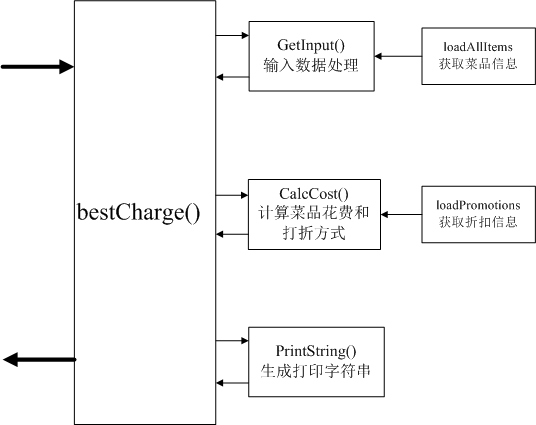
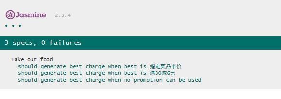
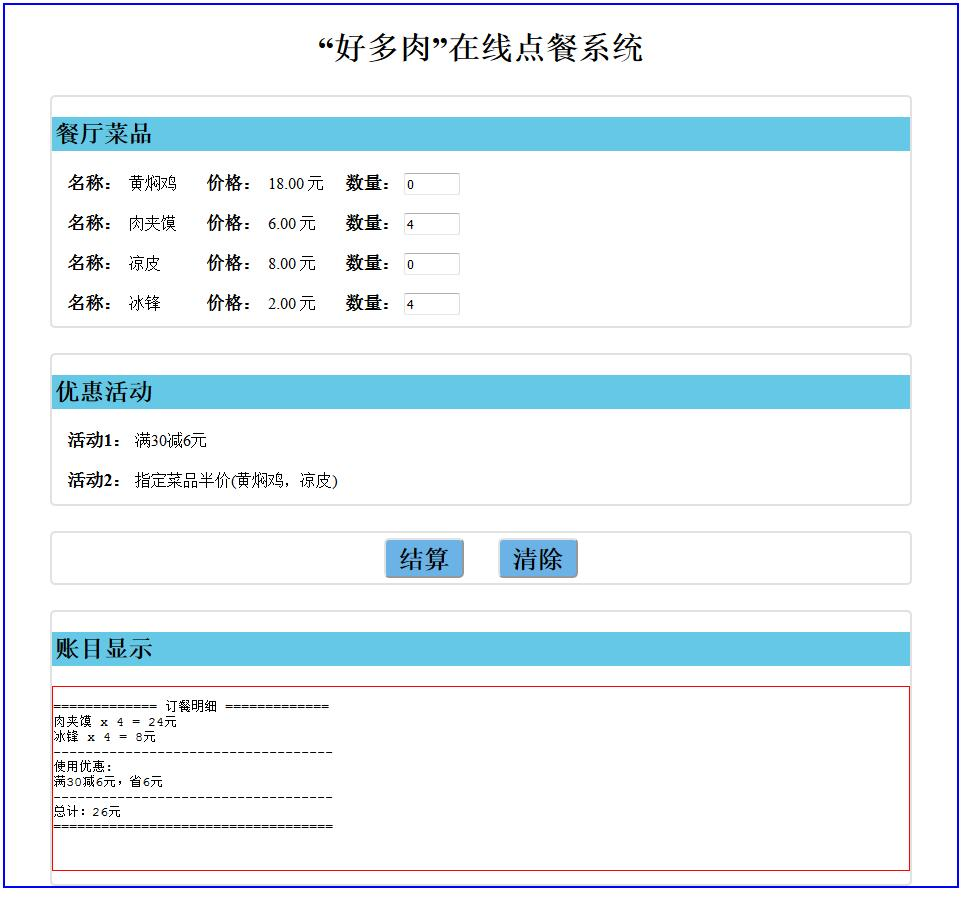

## 点餐系统程序结构分析

分析任务的需求，可以发现该任务可以分为3大块来处理：

1. 输入信息处理
2. 点餐花费结算
3. 输出字符串整合

#### 程序的管道图如下：



1. 输入信息处理过程通过输入的字符串以及loadAllItems获取输入菜品的id，名称，数量，价格信息，输出上述信息的JSON格式。
2. 点餐花费结算阶段通过loadPromotions获取所点菜品的折扣，计算点餐菜品的总花费，输出折扣计算方式和折扣后的价格。
3. 根据所点菜品名称和折扣计算方式，以任务要求的格式整合字符串结果。

#### 任务分解

```javascript
#GetInput()输入数据处理
输入：
	InputString；
    ItemsInfo[{
    	id: String,
   		name: String,
    	price: Number
  }]
输出：
	ItemJson[{
    	id:String,
        name:String,
        num:String,
        price:String
	}]
#CalcCost()点餐花费结算
输入：
	ItemJson[{
    	id:String,
        name:String,
        num:String,
        price:String
	}]
	Promotions[{
    	type: String,
    	items: Array
  	}]
输出：
	CostJson[{
    	string:String,
        cost:Number
	}]
#PrintString()输出字符串整合
输入：
	ItemJson[{
    	id:String,
        name:String,
        num:String,
        price:String
	}]
	CostJson[{
    	string:String,
        cost:Number
	}]
输出：ResultString：String
```
#### 运行测试结果
结果图下图所示


### 网页版点餐系统结果


--------------------------------------------------------------------------------------------

## 需求描述

某快餐品牌推出了它独家的外卖应用，用户可以在手机上直接下单。该应用会根据用户选择的菜品(Item)、数量(Count)和优惠方式(Promotion)进行计算，告诉用户需要支付的金额(Charge)。

优惠活动有多种形式。假设用户一次只能使用一种优惠，那么使用哪种优惠省钱最多就会是一个让用户头疼的问题。所以该外卖应用为了方便用户，在用户下单时，会自动选择最优惠的方式并计算出最终金额让用户确认。

我们需要实现一个名为`bestCharge`的函数，它能够接收用户选择的菜品和数量（以特定格式呈现）作为输入，然后返回计算后的汇总信息。

已知：

- 该店的菜品每一个都有一个唯一的id
- 当前的优惠方式有:
  - 满30减6元
  - 指定菜品半价
- 除菜品外没有其它收费（如送餐费、餐盒费等）
- 如果两种优惠方式省钱一样多，则使用前一种优惠方式

输入样例
-------

```
["ITEM0001 x 1", "ITEM0013 x 2", "ITEM0022 x 1"]
```

输出样例
-------

```
============= 订餐明细 =============
黄焖鸡 x 1 = 18元
肉夹馍 x 2 = 12元
凉皮 x 1 = 8元
-----------------------------------
使用优惠:
指定菜品半价(黄焖鸡，凉皮)，省13元
-----------------------------------
总计：25元
===================================
```

使用另一种优惠的样例
------------------

输入：

```
["ITEM0013 x 4", "ITEM0022 x 1"]
```


输出：

```
============= 订餐明细 =============
肉夹馍 x 4 = 24元
凉皮 x 1 = 8元
-----------------------------------
使用优惠:
满30减6元，省6元
-----------------------------------
总计：26元
===================================
```

如果没有优惠可享受
---------------

输入：

```
["ITEM0013 x 4"]
```

输出：

```
============= 订餐明细 =============
肉夹馍 x 4 = 24元
-----------------------------------
总计：24元
===================================
```


## 基础作业

1. 相关代码在`src`目录下
1. 实现`best-charge.js`中的`bestCharge`函数
1. 写代码前先使用tasking整理思路并画出管道图
1. 先写测试再写实现，代码须跟管道图匹配
1. 代码整洁、函数粒度合适、命名有意义


## 作业提示

1. 可使用`loadAllItems()`方法获取全部的菜品
2. 可使用`loadPromotions()`方法获取全部的优惠方式

## 运行测试

### 浏览器

可使用浏览器打开`run-specs.html`文件运行测试
